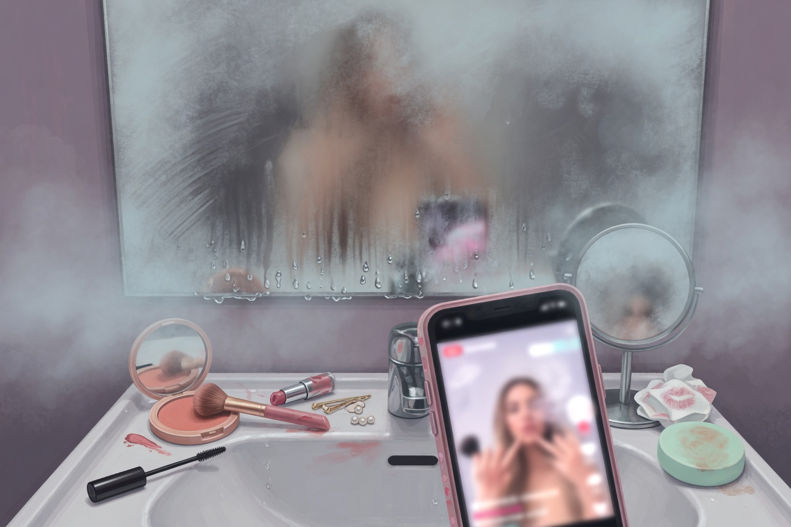

# Hi Sisters in the Mirror
multi-lingual and their ways of learning

In 2021 a medical student with a Japanese father and a Turkish schooling posted a video whose title still sounds like a dare. She had learned English by herself, for free, without studying. The description under that first film has since been overwritten by other work, so the method on the page is gone. What remains from that year, and from the year after, is enough to keep her in this series if we keep her where she was: not a course, not a system, a student in a room, trying to hear a YouTuber she liked.

She says, in the 2022 film that still has a full transcript, that she took English as her main foreign language until high school, then took German. She did not attend an international school. Most of the fluent friends she knew had been taught every subject in English. She had not. The country’s classrooms, as she describes them, asked for too much input and allowed too little output. Students listened and read. They did not, in a crowded hour, all get to talk. She understands why. She also knows why she left school still unable to do the one thing she actually wanted.

The thing she wanted was small enough to be almost embarrassing, which is why it is trustworthy. She was following James Charles. Hi sisters. She wanted to understand his videos. That was the only reason. Formal talking did not matter. Grammar did not matter. She was not planning to use English for a profession. She had a point on a map, and the point was a voice on a screen.

From that point she built a practice she later called, carefully, not for absolute beginners. Reach something like A2 first, she says in 2022. The method she used for English leans on output more than school did, but she has read — and she names the books — Kawasaki’s *Input Dictionary* and *Output Dictionary*, and she agrees with a ratio those books like: more output than input once you can output at all. At the very beginning, she says, input still has to come first. The disclaimer sits at the front of the video because she has already watched people copy her too early.

Then the days, as she tells them. She chose what to watch. She wanted daily speech, the kind that happens in vlogs when someone talks about being sore on a rest day, about a light workout, about a feeling. Lifestyle creators, native speakers, the leftover language of an ordinary afternoon. If vlogs were not a person’s taste, she says, then Netflix, series, films, songs — whatever could be enjoyed, because the main goal of the method was that it would not feel like studying. She watched at normal speed with subtitles, and she tried to understand, not only to let the images pass. She wanted an hour a day, a habit, a language that had become part of the date on the calendar.

Later she watched without subtitles, still aiming at that hour. After a video or a film or a podcast she tried to explain it back to herself in English, in her own words, without a translator at her elbow. If a word would not come after a real attempt, she would look it up. She talked to herself in daily life. She remembers the mirror. She was doing her makeup. She pretended she was a beauty creator. She explained the steps in English, alone in her room. That is how she learned, she says, and she knows how it sounds. She also knows she was not the only one doing it.

Reading arrived as a later demand. She teases people who do not read, then softens. Children’s books count. After a chapter, the same law as after a video: say it back in your own words. When the ear could take it, she sped the videos to 1.25 or 1.50 because native speakers do not do her the kindness of speaking slowly. She tells people to continue more than a year. School had already taken years and had not given her James Charles. A year of this, she argues, is not an insult.

The method had a wound in it, and she names the wound. Learning alone, she could not always hear her own mistakes. She said *foreigner* when she meant *foreign*, *propose* when she meant *purpose*, and she only found out because people in the comments told her. Without a channel, without native-speaker friends, she does not think she would have noticed. Doing something wrong at the beginning, she says, makes it hard to undo. The 2022 video is sponsored by italki, and she says so. She also says she wishes she had known such a place existed when she started, because she did not.

By the time she filmed the update she was using English for more than a beauty channel she did not host. University in English. Emails. Meetings. Books. A weekly conversation she mentions with friends. The original goal — understand this one creator — had opened rooms she had not been trying to open. She still does not sound, to herself, like a native speaker. She sounds, to herself, better than the girl in the mirror.

This column stays in that room. It does not follow her into later products, later branding, later advice sold as a course. Those things happened, and they are why she cannot be introduced as a permanent amateur. They are not why the 2021 and 2022 films are worth telling. Those films are about a student who was failed by a certain kind of school English, who wanted a YouTuber to make sense, who talked to her own reflection until the reflection began to answer.

